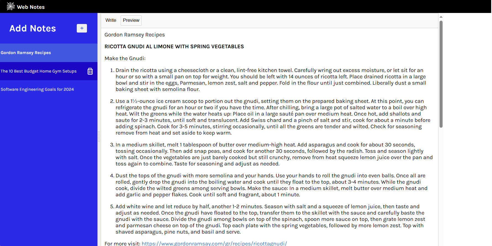
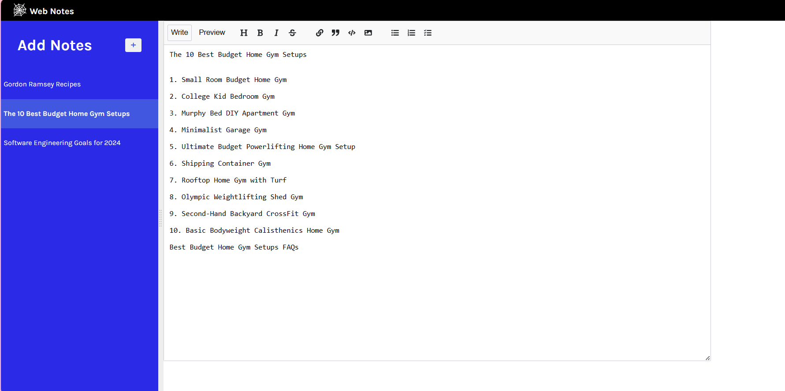

# react-markdown-notes-app

# A React WebNotes Application

A creative React application for taking and managing notes and diaries. Persisted data with Firebase Firestore and utilized Debouncing a technique that helps to improve performance and user experience in scenarios where frequent updates or actions need to be handled more efficiently.

## Table of Contents

- [Features](#features)
- [Demo](#demo)
- [Installation](#installation)
- [Usage](#usage)
- [Contributing](#contributing)
- [License](#license)

## Features

- Create, edit, delete and sort notes based on time created and edited
- Persisted Notes using first Local storage and later Firestore
- User-friendly interface
- Responsive design for various devices

## Demo

[React Web-Notes Application](https://react-webnote.netlify.app/)

## Installation

1. Clone the repository:

   ```bash
   git clone https://github.com/your-username/react-markdown-notes-app.git





2. Navigate to the project directory
- cd react-markdown-notes-app

3. Install Dependencies
- npm install

## Usage

1. npm start

## Contributing
- Fork the repository.
- Create a new branch: git checkout -b feature/new-feature.
- Commit your changes: git commit -am 'Add new feature'.
- Push to the branch: git push origin feature/new-feature.
- Submit a pull request.

## License
This project is licensed under the MIT License.


